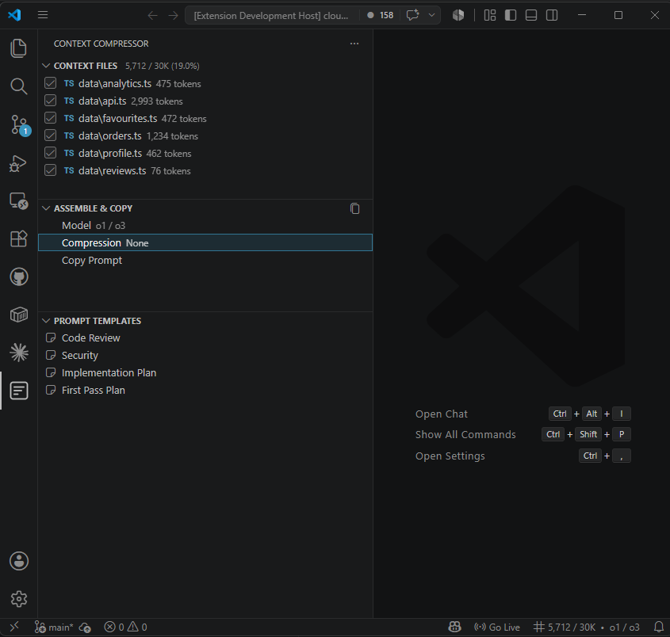

# Token Budget Builder

Assemble, compress, and copy multi-file prompts with a live token budget for any model.

Instead of pasting files into a chat window and guessing whether you fit under the context limit, Token Budget Builder lets you pick the files that matter, compress them locally, and copy a clean formatted prompt to the clipboard in one click. No API keys. Everything runs locally.

## How to Use

1. Open the **Context Compressor** panel in the Activity Bar.
2. In **Context Files**, add files via the toolbar or by right-clicking in the Explorer.
3. Check or uncheck files to include or exclude them. The token budget updates in real time.
4. In **Build Prompt**, click **Model** or **Compression** to adjust settings, then click **Copy Prompt** to assemble and copy.

To count tokens in a file or folder without adding it to context, right-click in the Explorer and choose **Count Tokens in Selection**.

## Compression Modes

| Mode | What it removes |
|---|---|
| None | nothing |
| Strip Comments | Line and block comments (JS/TS/Python/Go/Rust/C) |
| Collapse Whitespace | Blank lines and trailing spaces |
| Signatures Only | Function and class bodies; keeps signatures and docstrings |

## Line Filter

Line Filter lets you narrow down any text file to just the lines you care about, which is useful for trimming log output or large generated files before adding them to context.

**From the sidebar** (Line Filter panel): click "Keep matching lines..." or "Remove matching lines..." to enter a search term. Select text first and click "From selection" to filter using the selected text directly.

**From the editor** right-click menu: "Keep Matching Lines" and "Remove Matching Lines" are available in any open file.

Results open in a read-only document beside your editor. You can filter a result again to chain multiple filters, and the Filter Summary panel shows the full chain along with match counts.

**Input format:** plain text is matched case-insensitively as a literal string. Wrap in `/slashes/` for regex, optionally with flags: `/\bERROR\b/i`.

**Context lines:** click "Context: none" in the panel to include N lines above and below each match.

## Supported Models

| Model | Encoding | Context window |
|---|---|---|
| GPT-4o / GPT-4o mini | o200k_base | 128 000 |
| o1 / o3 | o200k_base | 200 000 |
| GPT-4 / GPT-4 Turbo | cl100k_base | 128 000 |
| GPT-3.5 Turbo | cl100k_base | 16 385 |
| Claude (approx.) | cl100k_base | 200 000 |
